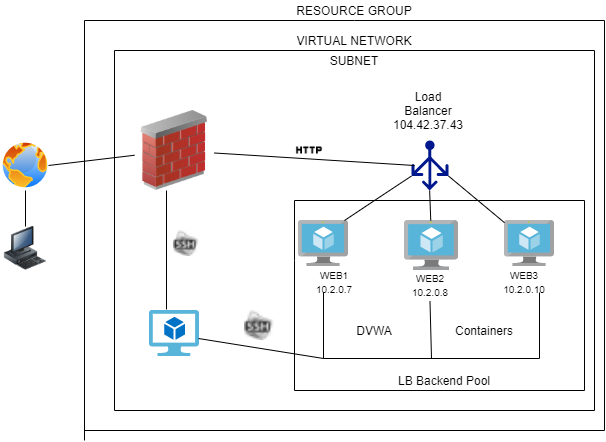
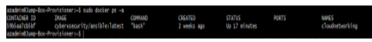

PLEASE NOTE - DUE TO THE DANGERS OF PUBLICALLY POSTING MY IP ADDRESS, I WILL BE REFERING TO MY IP ADDRESS AS (MYIP) FOR THE PURPOSES OF THIS TEXT DOCUMENT  

## Automated ELK Stack Deployment

The files in this repository were used to configure the network depicted below.
  

These files have been tested and used to generate a live ELK deployment on Azure. They can be used to either recreate the entire deployment pictured above. Alternatively, select portions of the ansible file may be used to install only certain pieces of it, such as Filebeat.

  - Ansible Playbook located at: root@59b5aa7cb5bf:/etc/ansible# 

This document contains the following details:
- Description of the Topology
- Access Policies
- ELK Configuration
  - Beats in Use
  - Machines Being Monitored
- How to Use the Ansible Build

### Description of the Topology

The main purpose of this network is to expose a load-balanced and monitored instance of the D*mn Vulnerable Web Application, or DVWA.

Load balancing ensures that the application will be efficient and responsive, in addition to restricting unwanted access to the network. 

-Load Balancers mask IPs behind their public IP address and may possibly help during a smaller scale DOS attack.  

Integrating an ELK server allows users to easily monitor the vulnerable VMs for changes to the file system and system resources.
- Filebeat "Beat" logs any changes to local files. 
- The metricbeat "Beat" allows adminstration to collect system metrics and monitor memory/network utilization.

The configuration details of each machine may be found below.
_

| Name      | Function     | IP Address   | Operating System |
|-----------|--------------|--------------|------------------|
| Jump Box  | Gateway      | 13.88.159.151| Linux            |
| Web-1     | WebServer    | 10.2.0.7     | Linux            |
| Web-2     | WebServer    | 10.2.0.8     | Linux            |
| Web-3     | WebServer    | 10.2.0.10    | Linux            |
| RedTeamVM | Kibana Host  | 10.4.0.4     | Linux            |
| RedTeamLB | Load Balancer| 104.42.37.43 | n/a              |

### Access Policies

The JumpBox (p22), the Load Balancer (p80) and RedTeamVM (p5601) are the machines that are exposed to the public Internet.
SSH connections are solely allowed into the JumpBox, but access is only available through (MYIP).

Machines within the network can only be accessed by the Ansible Docker Container inside the JumpBox.
- The RedTeamVM or Kibana Gui can only be accessed by (MYIP) and VM's on Virtual Networks: 10.2.0.0/16 ??

A summary of the access policies in place can be found in the table below.

| Name     | Publicly Accessible | Allowed IP Addresses |
|----------|---------------------|----------------------|
| Jump Box | Yes                 | (MYIP)               |
| Web-1    | No                  | 10.2.0.7             |
| Web-2    | No                  | 10.2.0.8             |
| Web-3    | No                  | 10.2.0.10            |
| RedTeamVM| SSH-no  HTTP-yes    | 10.4.0.4/(MYIP)      |

### Elk Configuration

Ansible was used to automate configuration of the ELK machine. No configuration was performed manually, which is advantageous because...
- ....ansible playbooks make installing new servers easy and can be used for a restart of the same environment incase of interruption.

The playbook implements the following tasks:
- Downloading and installation of Docker
- Installs python-pip3 and the pip docker module
- Increases size of vm.max_map_count variable to 262144 #sysctl -w vm.max_map_count=262144
- Installs ELK inside Docker container
- Ensures Docker and ELK start with system reboot

The following screenshot displays the result of running `docker ps` after successfully configuring the ELK instance.
 

### Target Machines & Beats
This ELK server is configured to monitor the following machines:
- Web-1 10.2.0.7
- Web-2 10.2.0.8
- Web-3 10.2.0.10

We have installed the following Beats on these machines:
- Web-1 Filebeat, Metricbeat
- Web-2 Filebeat, Metricbeat
- Web-3 Filebeat, Metricbeat

These Beats allow us to collect the following information from each machine:
- Filebeat "Beat" logs any changes to local files.
- Metricbeat "Beat" allows adminstration to collect system metrics and monitor memory/network utilization.

### Using the Playbook
In order to use the playbook, you will need to have an Ansible control node already configured. Assuming you have such a control node provisioned: 

SSH into the control node and follow the steps below:
- Copy the ansible file to "/etc/ansible/playbook"
- Update the /etc/ansible/hosts file to include the IPs of the servers we want to install packages on.
- Run the playbook and navigate to remote host to ensure installation is complete.

- My playbook is called elkplaybook.yml and I saved it to: /etc/ansible/elkplaybook.yml 
- _Which file do you update to make Ansible run the playbook on a specific machine? How do I specify which machine to install the ELK server on versus which to install Filebeat on?-
    -The etc/ansible/playbook must be updated to include the ELK and DVWA.
    -By adding the IPs of the servers that services will be installed on.
- _Which URL do you navigate to in order to check that the ELK server is running?
    -"http://[HOST-PUBLIC-IP]:5601/app/kibana"  (replace 'HOST-PUBLIC-IP' with host IP) 

_As a **Bonus**, provide the specific commands the user will need to run to download the playbook, update the files, etc._
